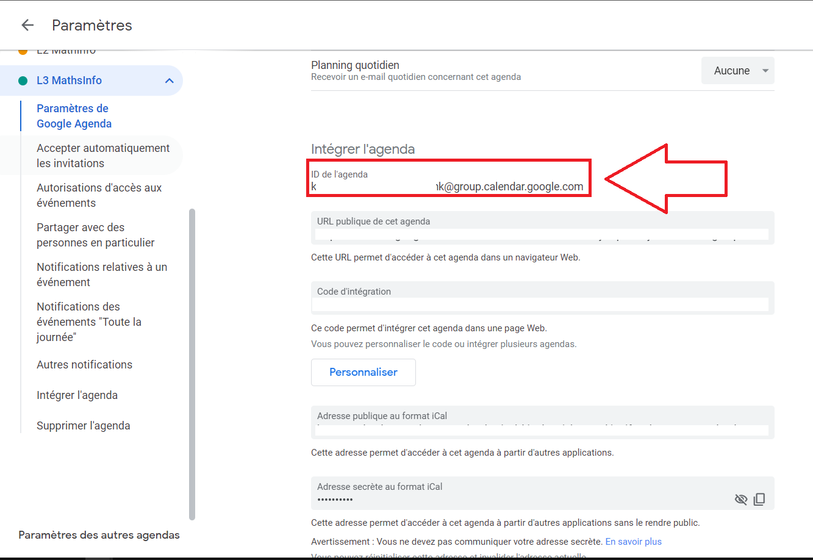

# Python Kal prototype

## Install dependencies

Preferably in a new [virtual environment](https://docs.python.org/fr/3/library/venv.html):

```sh
pip install -r requirements.txt
```

## Get your Google Api credentials

This project access to the [Google Calendar API](https://developers.google.com/calendar/api).
For this you will need to register a new project on the google cloud platform
[This article](https://karenapp.io/articles/how-to-automate-google-calendar-with-python-using-the-calendar-api/) describes how to register a new project, activate the Google Calendar API and get the `credentials.json` file.

Once you got your `credentials.json` file, place it under `/credentials_data`

## Start syncing !

### Mirrors

Go take a look in [mirrors/my_mirrors.py](./mirrors/my_mirrors.py)

You'll find this at the end

```python
my_mirror = Mirror(title="L3_maths_info",
                 source_ics_calendar_url="https://proseconsult.umontpellier.fr/jsp/custom/modules/plannings/direct_cal.jsp?data=...,1",
                 google_calendar_id="<YOUR_GOOGLE_CALENDAR_ID",
                 rules=_supermuel_rules)
```

A [Mirror](./src/mirror.py) describes :

- the source time schedule
- the google agenda in which the events are exported
- a set of [Rule](./src/event_rules.py)s that tells how to customize the events

The `source_ics_calendar_url` is the url you use to download the calendar file or to sync it in a similar software

The `google_calendar_id` can be found in the [Google Calendar settings page](https://calendar.google.com/calendar/u/0/r/settings) :


### Add rules :

The rules are pretty self-explanatory. For this mirror example, they are defined in the same [mirrors/my_mirrors.py](./mirrors/my_mirrors.py) file.

Let's see how to do it:

We first define a [Condition](./src/event_rules.py) object

```python
HAI501I_condition = Condition().field('title').contains('HAI501I', case_sensitive=False)  # Génie logiciel
```

This condition will match all events having `HAI501I` or event `hAI501i` in the title.

For the events that match this criteria, we can define a Rule, which is a set of actions to transform each event:

```python
Rule().prefix_str_to_field('title', 'Génie logiciel - ').change_color(EventColor.PEACOCK).on(HAI501I_condition),
```

This Rule tells Kal to change this event's color to PEACOCK (light blue). The colors available are the same colors available Google Calendar. They are defined in [events_colors.py](./src/event_colors.py)

This Rule also specify the make the event's title prettier by adding the course unit's name in the title.

By creating more conditions and more Rules, you can then create a complex set of rules:

```python
_supermuel_rules = [
    Rule().prefix_str_to_field('title', 'Calcul formel - ').change_color(EventColor.SAGE).on(HAI507I_condition),

    Rule().prefix_str_to_field('title', 'Génie logiciel - ').change_color(EventColor.PEACOCK).on(HAI501I_condition),

    Rule().prefix_str_to_field('title', 'Mesure et intégration, Fourier - ').change_color(EventColor.TOMATO).on(
        HAX503X_HAX505X_condition),

    Rule().prefix_str_to_field('title', 'Logique du premier ordre - ').change_color(EventColor.GRAPE).on(HAI504I_condition),
    Rule().prefix_str_to_field('title', 'Algorithmique 4 - ').change_color(EventColor.BLUEBERRY).on(HAI503I_condition),

    Rule().prefix_str_to_field('title', 'Calcul Différentiel et Equations Différentielles - ').change_color(EventColor.TANGERINE).on(HAX502X_condition),

    Rule().prefix_str_to_field('title', 'Groupes et anneaux 1 - ').on(HAX501X_condition),

    Rule().remove_event().on(HAX504X_condition),

    Rule().prefix_str_to_field('title', 'Théorie des Probabilités - ').change_color(
        EventColor.BANANA).on(HAX506X_condition),
]
```

More conditions and actions are available in [./src/event_rules.py](./src/event_rules.py).

Finally, add those rules to the mirror you are creating :

```python
my_mirror = Mirror(..., rules=_supermuel_rules)
```

### Run it !

In [main.py](main.py), you just have to call `run_service`

```python
from mirrors.my_mirrors import my_mirror

if __name__ == '__main__':
    run_service(my_mirror)
```

And that's it!

A navigator page will pop up for you to complete the OAuth flow.
